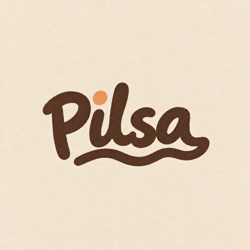

<p align="center">
  
</p>

<h1 align="center">Pilsa 소개 사이트</h1>

<p align="center">
  iPad와 Apple Pencil로 좋은 문장을 손으로 옮겨 쓰는 필사 노트<br>
  <a href="https://jsonpassion.github.io/pilsa-site/"><b>jsonpassion.github.io/pilsa-site</b></a>
</p>

---

앱과 같은 크림 종이와 두들 선으로 만든 한 장짜리 소개 페이지입니다. 페이지 안에서 흐린 글씨 위에 직접 따라 써 볼 수 있고, 읽어 주기와 빗소리도 켤 수 있어요. App Store 심사에 필요한 개인정보 처리방침과 이용약관도 함께 둡니다.

- 빌드 도구 없는 정적 HTML (CSS, JS 인라인)
- `main`에 푸시하면 GitHub Pages가 배포
- 외부 의존성은 Google Fonts(Gaegu, Gowun Dodum, Nanum Pen Script, Patrick Hand)뿐

## 구조

```
.
├── index.html          # 소개 페이지와 따라 쓰기 체험
├── privacy/index.html  # 개인정보 처리방침
├── terms/index.html    # 이용약관
├── icon.png            # 앱 아이콘 (파비콘 겸용)
└── assets/
    ├── wordmark.png            # 색이 있는 로고
    ├── wordmark_ink.png        # 로고 글씨 마스크 (다크 모드 대응)
    ├── wordmark_dot.png        # i 위 점 마스크
    └── og.png                  # 링크 미리보기
```

아이콘과 로고 이미지는 앱 저장소의 `tools/make_icon_variants.py --site <이 폴더>`로 다시 만듭니다.
